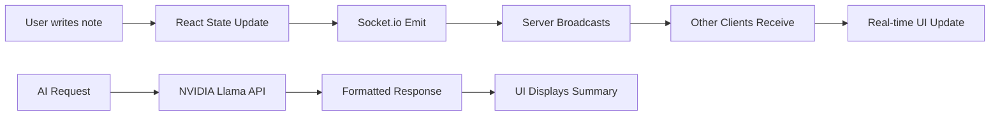

# CollabNotes — AI-Powered Collaborative Notes

<p align="center">
  
  
  
  
  
</p>

<p align="center">
  <a href="https://realtime-notes-ai.vercel.app">🌐 Live Demo</a>
  ·
  <a href="#-features">Features</a>
  ·
  <a href="#-tech-stack">Tech Stack</a>
  ·
  <a href="#-architecture">Architecture</a>
  ·
  <a href="#-getting-started">Setup</a>
</p>

---

## 📝 Description

**CollabNotes** is a real-time collaborative note-taking application with built-in AI capabilities. Write, organize, and collaborate on notes with your team while leveraging AI to summarize content, suggest titles, and extract tags automatically.

Built with a modern tech stack featuring **React**, **Node.js**, **Socket.io** for real-time sync, and **NVIDIA Llama 4** for AI-powered features.

---

## 🔗 Live Demo

🚀 **Access the app**: [https://realtime-notes-ai.vercel.app](https://realtime-notes-ai.vercel.app)

> **Note**: The backend is deployed on Railway. For the best experience, ensure the backend service is running.

---

## ✨ Features

### Core Features
- 📝 **Rich Text Note Editor** — Create and edit notes with a beautiful, distraction-free interface
- 🔄 **Real-time Collaboration** — Changes sync instantly across all connected clients via Socket.io
- 👥 **Collaborative Editing** — Share notes with teammates and see their cursor positions live
- 🏷️ **Tag System** — Organize notes with customizable tags
- 📚 **Version History** — Never lose your work with automatic version snapshots

### AI-Powered Features
- 🤖 **AI Summaries** — Generate bullet points, paragraphs, poems, or key takeaways from your notes
- 🎯 **Smart Auto-Title** — AI suggests concise titles based on your content
- 🏷️ **AI Tag Suggestions** — Get intelligent tag recommendations
- 📊 **Multiple Summary Styles** — Choose from:
  - Bullet Points
  - Paragraph
  - Poetic
  - One-Liner
  - Key Takeaways
  - ELI5 (Explain Like I'm 5)

### UI/UX Features
- 🌌 **Aurora Background** — Beautiful animated gradient background with drifting stars
- 📱 **Responsive Design** — Works seamlessly on desktop and mobile
- 🎨 **Modern Dark Theme** — Easy on the eyes with a sleek dark aesthetic
- 📦 **Archive & Delete** — Manage notes with smooth animations
- 💬 **Floating Action Menu** — Quick access to upcoming features

---

## 🛠 Tech Stack

### Frontend
| Technology | Purpose |
|------------|---------|
| **React 18** | UI Framework |
| **Vite** | Build Tool |
| **Tailwind CSS** | Styling |
| **Socket.io Client** | Real-time Communication |
| **React Router** | Navigation |
| **Axios** | HTTP Client |

### Backend
| Technology | Purpose |
|------------|---------|
| **Node.js** | Runtime |
| **Express** | Web Framework |
| **Socket.io** | Real-time Server |
| **MongoDB (Atlas)** | Database |
| **NVIDIA Llama 4** | AI Summarization |
| **Passport.js** | Google OAuth |
| **Helmet** | Security |

### Deployment
| Service | Purpose |
|---------|---------|
| **Vercel** | Frontend Hosting |
| **Railway** | Backend API |
| **MongoDB Atlas** | Database |

---

## 🏗 Architecture

```
┌─────────────────────────────────────────────────────────────────────────────┐
│                              CLIENT (Vercel)                                │
│  ┌──────────────┐    ┌──────────────┐    ┌──────────────┐                │
│  │   React App   │◄──►│  Socket.io   │◄──►│  AI Features │                │
│  │  (NoteEditor) │    │   Client     │    │  (Summarize) │                │
│  └──────────────┘    └──────┬───────┘    └──────────────┘                │
│                             │                                               │
│                      ┌──────▼───────┐                                      │
│                      │  AuthContext │                                      │
│                      └──────────────┘                                      │
└─────────────────────────────┬─────────────────────────────────────────────┘
                              │ HTTPS
┌─────────────────────────────▼─────────────────────────────────────────────┐
│                           BACKEND (Railway)                                 │
│  ┌──────────────┐    ┌──────────────┐    ┌──────────────┐                │
│  │   Express    │◄──►│   Socket.io   │    │    Routes    │                │
│  │    Server    │    │    Server     │    │  (REST API)  │                │
│  └──────┬───────┘    └──────────────┘    └──────┬───────┘                │
│         │                                        │                        │
│  ┌──────▼───────┐                        ┌──────▼───────┐                │
│  │   Passport   │                        │  MongoDB    │                │
│  │ (Google OAuth)                        │   (Atlas)   │                │
│  └──────────────┘                        └──────────────┘                │
│                                                                             │
│  ┌──────────────────────────────────────────────────────────────┐         │
│  │                    AI Service (NVIDIA Llama 4)             │         │
│  │  • /api/summary   — Generate AI summaries                    │         │
│  │  • /api/ai/suggest — Smart title & tag suggestions           │         │
│  └──────────────────────────────────────────────────────────────┘         │
└─────────────────────────────────────────────────────────────────────────────┘
```

### Data Flow



---

## 📸 Screenshots

> Add your screenshots here

| Login Page | Dashboard | Note Editor with AI |
|------------|-----------|---------------------|
|  |  |  |

| Sidebar with Archive | AI Summary Panel | Mobile View |
|---------------------|------------------|-------------|
|  |  |  |

---

## 🚀 Getting Started

### Prerequisites

- Node.js 18+
- npm or yarn
- MongoDB Atlas account (free tier)
- Google Cloud Console project (for OAuth)
- NVIDIA NGC account (for AI API)

### Clone the Repository

```bash
git clone https://github.com/your-username/collab-notes.git
cd collab-notes
```

### Backend Setup

```bash
cd server
cp .env.example .env
```

Edit `.env` with your credentials:

```env
# Server
PORT=5000
NODE_ENV=development

# MongoDB
MONGODB_URI=your_mongodb_connection_string

# JWT
JWT_SECRET=your_super_secret_random_string

# Google OAuth
GOOGLE_CLIENT_ID=your_google_client_id
GOOGLE_CLIENT_SECRET=your_google_client_secret
GOOGLE_CALLBACK_URL=http://localhost:5001/api/auth/google/callback
CLIENT_URL=http://localhost:5173

# NVIDIA AI
NIM_API_KEY=your_nvidia_api_key
```

Install and run:

```bash
npm install
npm run dev
```

### Frontend Setup

```bash
cd client
cp .env.example .env
```

Edit `.env`:

```env
VITE_SERVER_URL=http://localhost:5001
```

Install and run:

```bash
npm install
npm run dev
```

---

## 📦 Environment Variables

### Server (.env)

| Variable | Description | Required |
|----------|-------------|----------|
| `PORT` | Server port | Yes |
| `MONGODB_URI` | MongoDB connection string | Yes |
| `JWT_SECRET` | Secret for JWT tokens | Yes |
| `GOOGLE_CLIENT_ID` | Google OAuth Client ID | Yes |
| `GOOGLE_CLIENT_SECRET` | Google OAuth Client Secret | Yes |
| `GOOGLE_CALLBACK_URL` | OAuth callback URL | Yes |
| `CLIENT_URL` | Frontend URL | Yes |
| `NIM_API_KEY` | NVIDIA API key for Llama 4 | Yes |

### Client (.env)

| Variable | Description | Default |
|----------|-------------|---------|
| `VITE_SERVER_URL` | Backend URL | http://localhost:5001 |

---

## 🔧 API Endpoints

### Authentication
- `GET /api/auth/google` — Google OAuth login
- `GET /api/auth/google/callback` — OAuth callback
- `GET /api/auth/me` — Get current user

### Notes
- `GET /api/notes` — List user's notes
- `POST /api/notes` — Create new note
- `GET /api/notes/:id` — Get single note
- `PUT /api/notes/:id` — Update note
- `DELETE /api/notes/:id` — Delete note (owner only)
- `PATCH /api/notes/:id/archive` — Toggle archive
- `PATCH /api/notes/:id/restore` — Restore version

### AI Features
- `POST /api/summary/:noteId` — Generate AI summary
- `POST /api/ai/suggest` — Get title & tag suggestions

---

## 🤝 Contributing

1. Fork the repository
2. Create your feature branch (`git checkout -b feature/amazing-feature`)
3. Commit your changes (`git commit -m 'Add some amazing feature'`)
4. Push to the branch (`git push origin feature/amazing-feature`)
5. Open a Pull Request

---

## 📄 License

This project is licensed under the MIT License.

---

## 🙏 Acknowledgments

- [NVIDIA Llama 4](https://build.nvidia.com/) — AI-powered summaries
- [MongoDB Atlas](https://www.mongodb.com/atlas) — Free database hosting
- [Vercel](https://vercel.com) — Free frontend hosting
- [Railway](https://railway.app) — Free backend hosting

---

<p align="center">Made with ❤️ using React, Node.js, and AI</p>